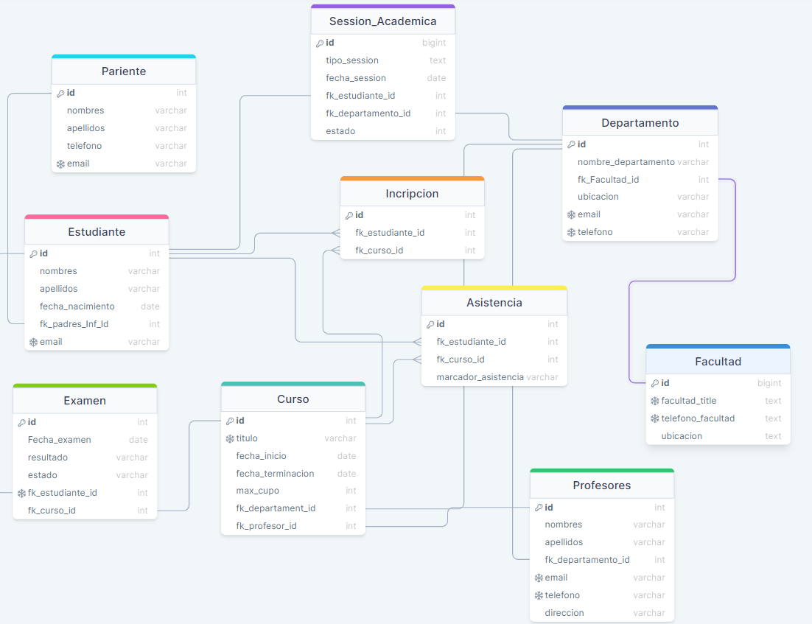

# Universidad base de datos

## Modelo Relacional



## Consultas

1. Estudiante que esten Pasi Salvo con su id y fecha de inico
```sql
SELECT tipo_session as Jornada,fecha_session as Inicio de la Session, fk_estudiante_id as Estudiante,
IF(estado='Pendiente','No cumple','Bien')
FROM Session_Academica as Sec
    WHERE Sec.estado NOT IN('Pendiente'); 
```

2. Estudiantes que terminaron las session por jornadas
```sql
SELECT tipo_session as Jornada, COUNT(tipo_session) as Estudiantes FROM Session_Academica GROUP BY tipo_session;
```
3. Facultad buscadas por sus ubicaciones
```SQL
SELECT ubicacion as Edficio, facultad_title as Facultad FROM Facultad;
```
4. Facultad especifica de su ubicacion
```sql
SELECT facultad_title as Facultad FROM Facultad WHERE ubicacion='Edificio A';
```
5. Cantidad estudiantes aprobados y reprobados
```sql
SELECT COUNT(estado) as Estudiantes_Aprobados FROM Examen WHERE estado='Aprobado' GROUP BY estado;
SELECT COUNT(estado) as Estudiantes_Aprobados FROM Examen WHERE estado='Reprobado' GROUP BY estado;
```
6. Agrupa Cantidad de examenes de un curso
```sql
SELECT COUNT(fk_curso_id) as Curso_Id FROM Examen WHERE  GROUP BY fk_curso_id;
```
7. Muestra el nombre del curso su departamenot y nombre del profesor
```sql
SELECT
    c.titulo as Curso, 
    d.nombre_departamento as Departamento, 
    CONCAT(p.nombres,' ',p.apellidos) as Profesor 
FROM Curso c 
JOIN Profesores p ON c.fk_profesor_id = p.id 
JOIN Departamento d ON c.fk_departament_id = d.id;
```
8. Muestra el nombre del curso su departamenot y nombre del profesor a los cursos con capacidad menor 40
```sql
SELECT 
    c.titulo as Curso, 
    d.nombre_departamento as Departamento, 
    CONCAT(p.nombres,' ',p.apellidos) as Profesor 
FROM Curso c 
JOIN Profesores p ON c.fk_profesor_id = p.id 
JOIN Departamento d ON c.fk_departament_id = d.id
WHERE c.max_cupo < 40;
```
9. Muestre los estudiantes y su curso
```sql
SELECT CONCAT(e.nombre,' ',e.apellidos) as Nombre_Estudiante, c.titulo as Curso
FROM Estudiante e
JOIN Inpscripcion i ON e.id = i.fk_estudiante_id
JOIN Curso c ON i.fk_curso_id = c.id;
```
10. Muestra los Estudiantes Aprobados gracias al examen
```sql
SELECT CONCAT(e.nombre,' ',e.apellidos) as Estudiante, c.titulo as Curso ,ex.estado as Estado
FROM Estudiante e
JOIN Examen ex ON e.id = ex.fk_estudiante_id;
```
11. Muestra la informacion de un departamento
```sql
SELECT * FROM Departamento WHERE id = 3;
```
12. Muestra los departamentos que pertenecen a una facultad 
```sql
SELECT * FROM Departamento WHERE fk_Facultad_id = 1;
```
13. Muestra la informacion de un pariente 
```sql
SELECT * FROM Pariente WHERE id = 1225689741;
```
14. Muestra el pariente asociado a un estudiante
```sql
SELECT * FROM Pariente 
WHERE 
id IN (SELECT pariente_id FROM Estudiante WHERE id = 51241)
```
15. Muestra la informacion de un profesor
```sql
SELECT * FROM Profesores WHERE id = 100653;
```
16. Muestra todos los profesores que pertenecen a un departamento
```sql
SELECT * FROM Profesores WHERE fk_departamento_id = 1;
```