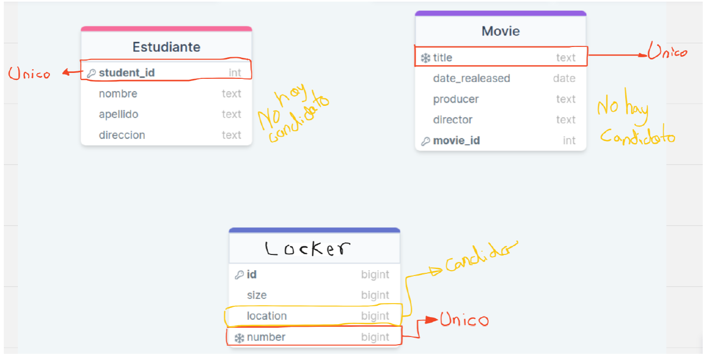

# Practica 2-4
1. ¿Cómo se busca una canción determinada en una recopilación completa?
    ¿Cuál sería un identificador único de SONG?
    R/
    Para identificar una cancion, primero no funcionara el nombre aunque las
    canciones se conocen por su nombre, tambien eso va ligado al artista, pero
    combinar estos datos, tambien hace que sea propenso a que haya
    concidencias.
    Mi propuesta para identificar la cancion, un identificar unico compuesto,
    sacado de el identificador unico del Autor, y del identificar unico del album del
    artista.
2. Piense en todos los alumnos de la clase. Cada alumno se describe mediante
diferentes rasgos o atributos. ¿Qué atributo o atributos permiten seleccionar
un único alumno respecto al resto de la clase?
R/
N° Identificador
En cualquier academia se necesita el numero de identificacion nacional para
si mismo evitar estos problemas.
3. Para cada entidad, seleccione el atributo que pueda ser el identificador único
de cada entidad. Entidad: STUDENT Atributos: student ID, first name, last
name, address Entidad: MOVIE Atributos: title, date released, producer,
director Entidad: LOCKER Atributos: size, location, number
R/
STUDENT => student ID MOVIE => title LOCKER => number

