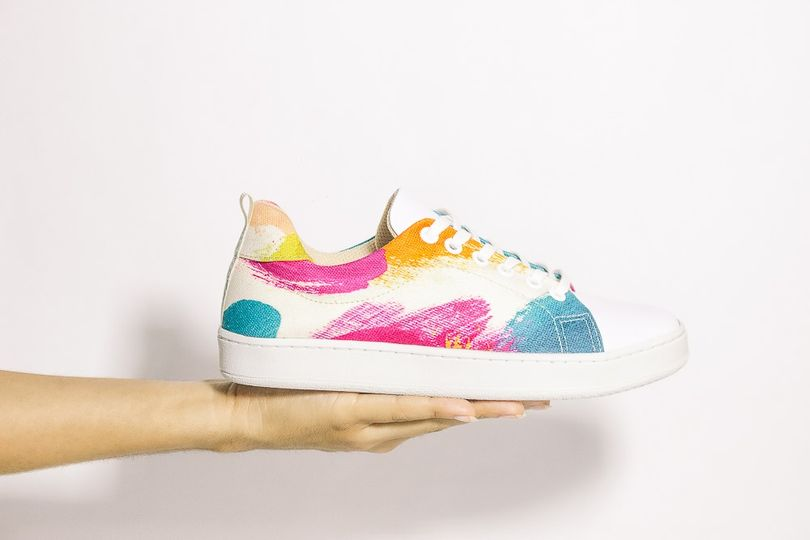
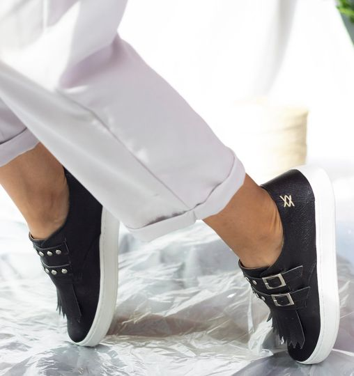
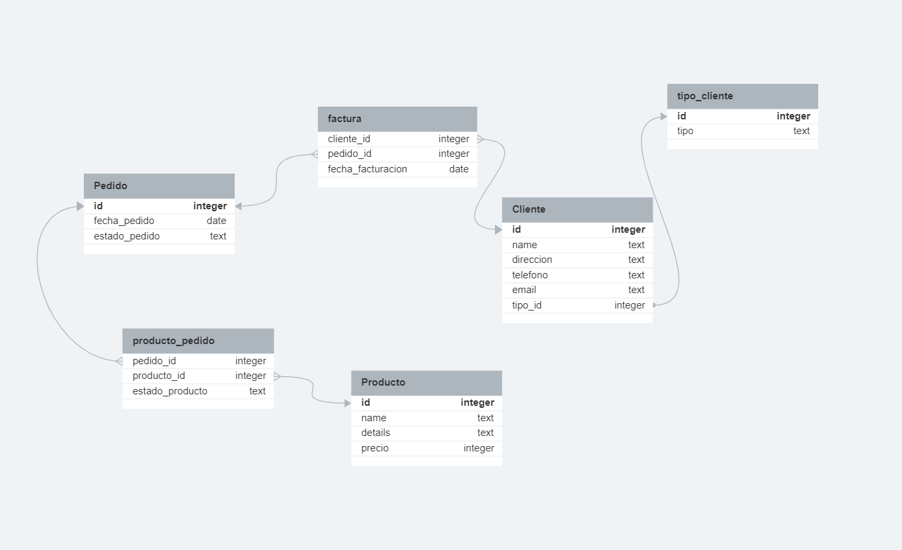
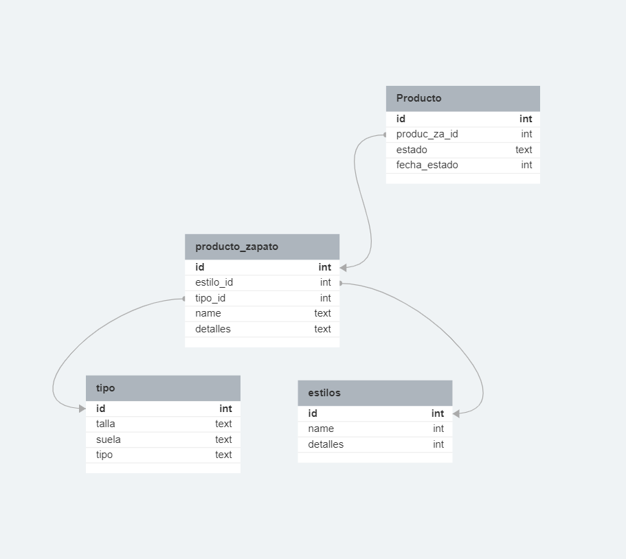

# Taller Base de Dato

## 2-2: Modelos de datos conceptuales y físicos Prácticas

### Contexto
La empresa es de zapatos se dedida a fabricar y vender zapatos personalizados ademas de estilos variados los cuales ee debide en tipos

Hay muchos estilos, por lo general hay algunos estilos que se pueden en tela y no en cuero, y vicerversa.

### Requerimientos que necesita la empresa:
- **Produccion** La empresa requiere un sistema de gestion de zapatos en produccion los cuales necesita que se necesita saber si el zapato esta en espera, esamblado y listo.
- **Inventario** Se necesita un parte para la gestion del inventario de los cuales se sepa que zapatos estan listos para armar pedido, tambien si no tiene aun un cliente y solo son para venta en tiendas.
- **Pedidos** Se necesita el gestor de pedidos, donde el pedido puede ser una persona natural, o una entidad encargada de vender en su sucursales, dichos zapatos.
- **Proveedores** Se necesita ademas gestionar las compras de materia de la empresa, donde estan los proveedores de tela, cuero, suelas y cordones.
- **Facturacion** La empresa ademas necesita llevar a la contabilidad osea necesita las facturas tanto de los zapatos vendido como de los recursos comprados.

### Modulos Escojidos:

#### Pedidos

Los pedidos se gestionaran de manera que el cliente se aun registro el cual se identificara, entonce el cliente puede tener varios pedidos, los cuales se le asignan por medio de la id

#### Produccion

Para la produccion se obtiene los datos de un producto los cuales se basa en el pedido. no se hacen zapatos si no son pedidos con antelacion o tambien se puede tener en bodegas.

